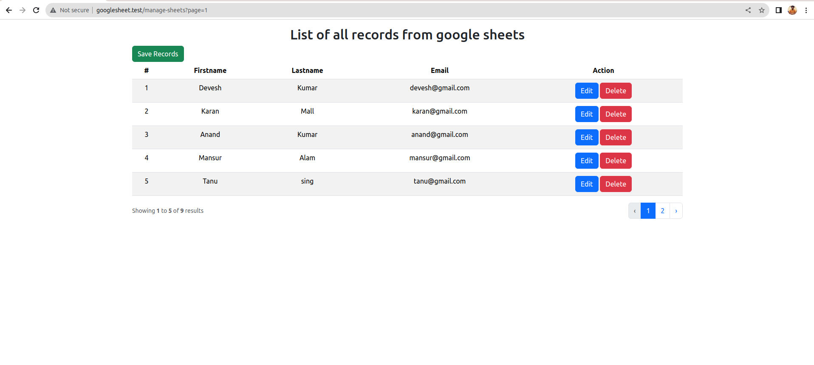
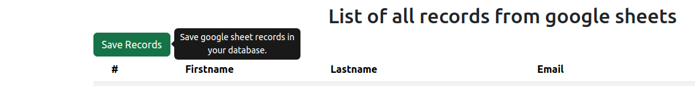
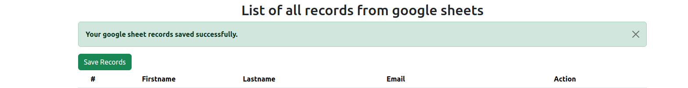
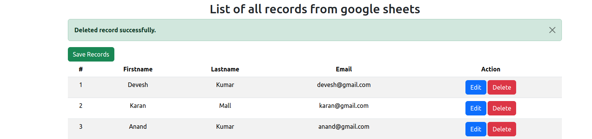
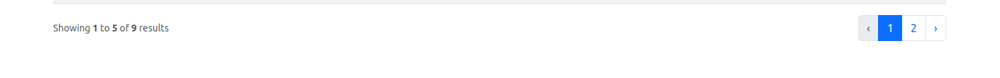
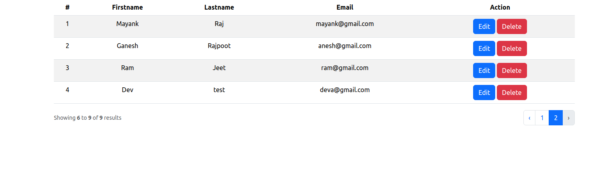

## Screenshots:



### tooltip/Save Records
- Save Records button does to save google sheet records in youd database on click


- After click on Save Records button then response


### Delete Button 
- Delete is use to delete.remove the record from database (soft delete)  and you can see response message also
- 

### Pagination 
- In pagination only 5 records will show per page (1st page)


- 2nd page


- New edit button is not working right now

<p align="center"><a href="https://laravel.com" target="_blank"></a></p>

<p align="center">
<a href="https://github.com/laravel/framework/actions"></a>
<a href="https://packagist.org/packages/laravel/framework"></a>
<a href="https://packagist.org/packages/laravel/framework"></a>
<a href="https://packagist.org/packages/laravel/framework"></a>
</p>


## Setup Google Doc Sheet 

1. Created a laravel project as: google-doc-sheet 
2. Generated laravel key: php artisan key:generate
3. Modify the users table migration file as: first_name, last_name, and email
4. Run laravel migration command
5. Install google apiclient: composer require google/apiclient
6. Install: composer require guzzlehttp/guzzle
7. Go to google cloud 
	. API & Services page
	. click on Enable APIs and services (google sheet, google Drive)
	. Open API Library page then I have selecte Google Sheet API option
	. Do Google sheet enable option

8. Go to Create Credential of google sheet
	1. Select in drop down Google Sheet API
	2. I choose User data
	3. Proceed to Next
	4. OAuth Consent Screen
		1. Set App name
		2. Give user csupport email: bit.devesh2030@gmail.com
		3. Save and continue

9. Install google sheet package 
	1. composer require revolution/laravel-google-sheets
    2. Set up google credential like Client id, client secret key
    3. Set Google Servie enable as true
    5. Set credential in config/google file
    6. I have created a vertual host to run this project, because i am using docker in my system
	
10. set configuration file : php artisan vendor:publish --tag="google-config"
11. After the all setup then start the implementation of code
12. Added Tooltip on button using bootstrap 5

### Database setup
- Created a database as `google_sheet`
- Run migration
- please follow as:
```
    php artisan migrate
```
- I have used `users` to store my google sheet records
- Added soft deletes feature
- In this table have created column as: first_name, last_name, email, password, email_verify_at, created_at, updated_at, deleted_at

### Pagination
- Added pagination by using $user->links()
- Bind Paginator bootstrap fine in AppService Provider file


## About Laravel

Laravel is a web application framework with expressive, elegant syntax. We believe development must be an enjoyable and creative experience to be truly fulfilling. Laravel takes the pain out of development by easing common tasks used in many web projects, such as:

- [Simple, fast routing engine](https://laravel.com/docs/routing).
- [Powerful dependency injection container](https://laravel.com/docs/container).
- Multiple back-ends for [session](https://laravel.com/docs/session) and [cache](https://laravel.com/docs/cache) storage.
- Expressive, intuitive [database ORM](https://laravel.com/docs/eloquent).
- Database agnostic [schema migrations](https://laravel.com/docs/migrations).
- [Robust background job processing](https://laravel.com/docs/queues).
- [Real-time event broadcasting](https://laravel.com/docs/broadcasting).

Laravel is accessible, powerful, and provides tools required for large, robust applications.

## Learning Laravel

Laravel has the most extensive and thorough [documentation](https://laravel.com/docs) and video tutorial library of all modern web application frameworks, making it a breeze to get started with the framework.

You may also try the [Laravel Bootcamp](https://bootcamp.laravel.com), where you will be guided through building a modern Laravel application from scratch.

If you don't feel like reading, [Laracasts](https://laracasts.com) can help. Laracasts contains over 2000 video tutorials on a range of topics including Laravel, modern PHP, unit testing, and JavaScript. Boost your skills by digging into our comprehensive video library.

## Laravel Sponsors

We would like to extend our thanks to the following sponsors for funding Laravel development. If you are interested in becoming a sponsor, please visit the Laravel [Patreon page](https://patreon.com/taylorotwell).

### Premium Partners

- **[Vehikl](https://vehikl.com/)**
- **[Tighten Co.](https://tighten.co)**
- **[Kirschbaum Development Group](https://kirschbaumdevelopment.com)**
- **[64 Robots](https://64robots.com)**
- **[Cubet Techno Labs](https://cubettech.com)**
- **[Cyber-Duck](https://cyber-duck.co.uk)**
- **[Many](https://www.many.co.uk)**
- **[Webdock, Fast VPS Hosting](https://www.webdock.io/en)**
- **[DevSquad](https://devsquad.com)**
- **[Curotec](https://www.curotec.com/services/technologies/laravel/)**
- **[OP.GG](https://op.gg)**
- **[WebReinvent](https://webreinvent.com/?utm_source=laravel&utm_medium=github&utm_campaign=patreon-sponsors)**
- **[Lendio](https://lendio.com)**

## Contributing

Thank you for considering contributing to the Laravel framework! The contribution guide can be found in the [Laravel documentation](https://laravel.com/docs/contributions).

## Code of Conduct

In order to ensure that the Laravel community is welcoming to all, please review and abide by the [Code of Conduct](https://laravel.com/docs/contributions#code-of-conduct).

## Security Vulnerabilities

If you discover a security vulnerability within Laravel, please send an e-mail to Taylor Otwell via [taylor@laravel.com](mailto:taylor@laravel.com). All security vulnerabilities will be promptly addressed.

## License

The Laravel framework is open-sourced software licensed under the [MIT license](https://opensource.org/licenses/MIT).

